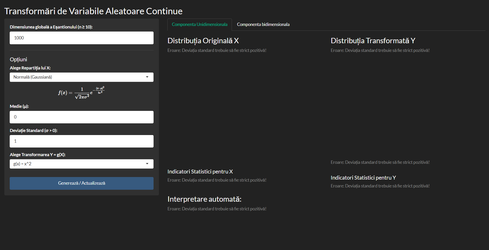
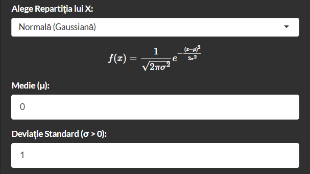
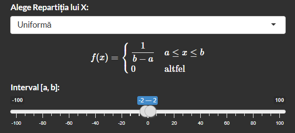
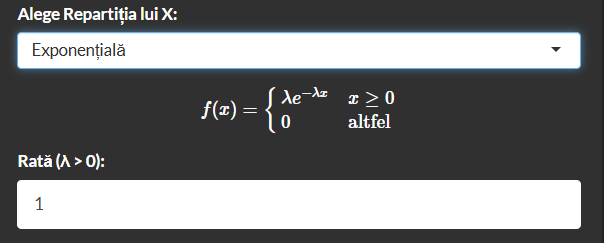
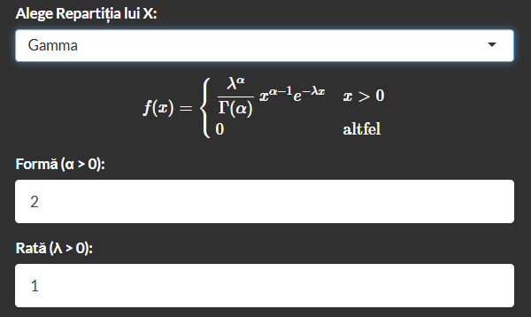
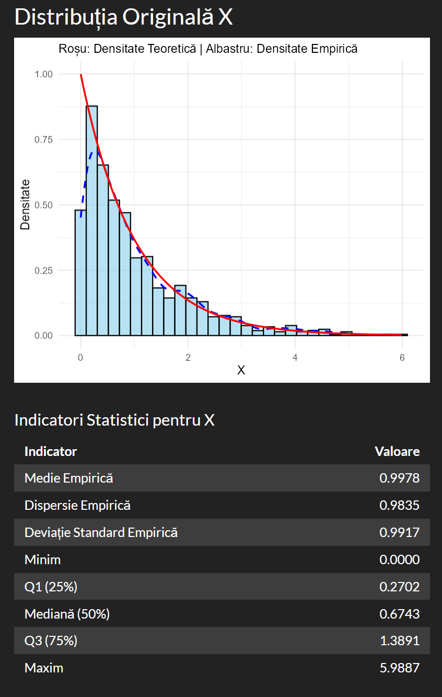
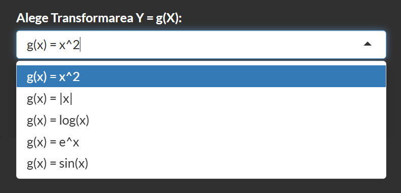
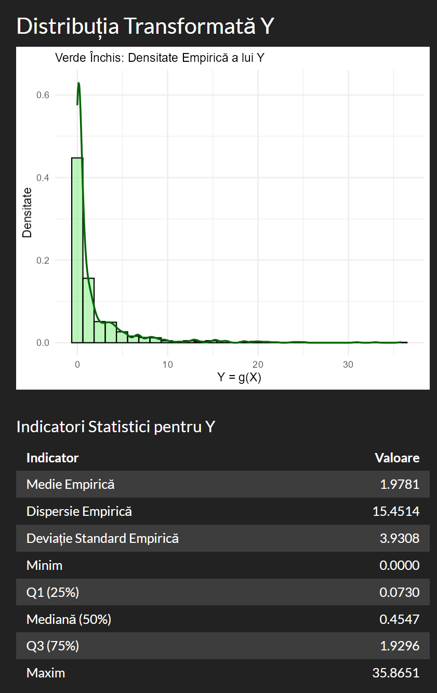
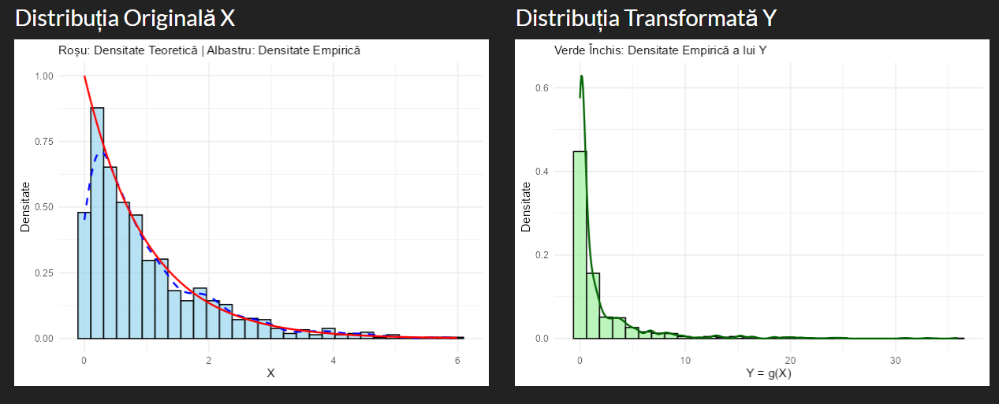
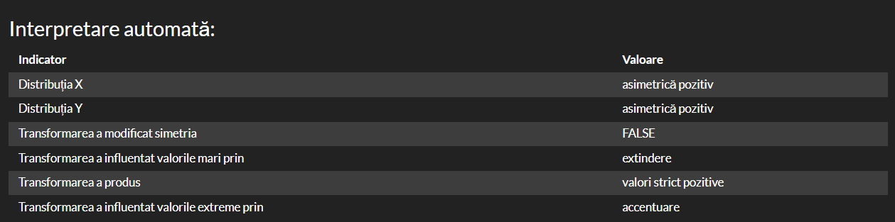

```{r}
#| include: false

# Fie probabilitatea ca un acces sa fie dubios sa fie p = 0.01
# Putem considera ca un nr total de accesuri per zi urmaresc
# repartitia Poisson, deoarece modelul nostru matematic se bazeaza
# pe evenimente ce se intampla intr-un interval fix(acces la resursa)

# Sa consideram lambda = 1000, un avg. de accesuri per zi.
# Fiecare zi are un total n de accesuri
# Accese per zi ~ Poisson(365, lambda)


#set.seed(87)

lambda  <- 1000 # PARAMETRIZABIL
p       <- 0.01 # PARAMETRIZABIL
#p      <- 0.05
#p      <- 0.2
nr_zile <- 365

total_cereri <- rpois(nr_zile, lambda)

# Sa zicem ca nr de accese sus sunt ~ Binom

cereri_sus <- rbinom(
  n = nr_zile,
  size = total_cereri,
  prob = p
)

date <- data.frame(
  zi = 1:nr_zile,
  total = total_cereri,
  normale = total_cereri - cereri_sus,
  sus = cereri_sus
)


# STRATEGII VERIFICARE

# VERIFICARE SIMPLA

# cereri per zi, 10%
# ziua 1 100 (5 sus) -> 10
# ziua 2 123 -> 23

# Pt a verifica extragem 10% din acel total per zi
# sample?
proc_verificare <- 10 / 100 #PARAMETRIZABIL
date$verificate_s <- floor(date$total * proc_verificare)
#sample(date$total, size = as.integer(date$total * proc_verificare), 
#       replace = FALSE,
#       p = date$sus / date$total # nr caz fav / total
#\      )

# VERIFICARE ADAPTIVA

# dupa lambda, daca per zi sunt mai multe cereri decat baseline-ul
# average de lambda = 1000, adaptam procentul dinamic

# Consideram ca pe langa un baseline de 20% de cereri verificate
# mai adaugam procente dupa cat de mult depaseste sau scade sub valoarea medie
# deja stiuta, adica lambda = 1000.
# proc_adapt <- 20 / 100 + (date$total - lambda)/lambda
# date$verificate <- floor(date$total * proc_adapt)
proc_adapt <- 20 / 100 + abs(date$total - lambda) * 80/100
date$verificate_a <- floor(date$total * proc_adapt / 100)


#alta idee, varianta in numarator
proc_adapt2 <- (20 +  abs(date$total - lambda) * 0.4) / 100
date$verificate_a2 <- floor(date$total * proc_adapt2)
# TO:DO e ft shit strategia, tb sa o facem cumva sa fie mai agresiva pe spike-uri.


# ===========RULAT INDIFERENT DE TIPUL DE VERIFICARE=============


# hypergeom
# Repartitia hypergeometrica are
#ca parametrii N total, N1 de normale,
#N2 cele sus, K cate verificam actually

date$detectate_s <- rhyper(
  nn <- nr_zile,
  m = date$sus, # N2
  n = date$normale, #N1
  k = date$verificate_s # actual nr verificate
)
date$nedetectate_s <- date$sus - date$detectate_s

date$detectate_a <- rhyper(
  nn <- nr_zile,
  m = date$sus, # N2
  n = date$normale, #N1
  k = date$verificate_a # actual nr verificate
)
date$nedetectate_a <- date$sus - date$detectate_a

date$detectate_a2 <- rhyper(
  nn <- nr_zile,
  m = date$sus, # N2
  n = date$normale, #N1
  k = date$verificate_a2 # actual nr verificate
)
date$nedetectate_a2 <- date$sus - date$detectate_a2

# Cerinta 5. Pt. fiecare strategie se calculeaza
# a)        - probabilitate empirica de a detecta cel putin o cerere sus/per zi
# b)        - proportie medie de cereri suspecte detectate
# c)        - proportie medie de cereri suspecte nedetectate
# d)        - nr mediu de verificari efectuate zilnic
# e)        - un indicator de eficienta, definit de NOI
#               EIGRP metric??????????

# a)
vector_logic <- date$detectate_s > 0
prob_empiric <- sum(vector_logic) / length(vector_logic)
# alternativ mean(date$detectate > 0)

# b)
# consideram proportia per total, maybe considerat si pt detectate/suspecte

#mean(date$detectate / date$total)
mean(date$detectate_s / date$sus)
# in proportie detectezi din 10 suspicioase doar una.

# c)
mean(date$nedetectate_s / date$sus)

# d)
mean(date$verificate_s)

# e)
mean(date$detectate_s) / mean(date$verificate_s) * 100
# metrica tris
# Alright sprinters we'll put a pin on that!!!!!!


# Cerinta 6. Vizualizari
# a)        - histograma nr de cereri sus per zi (frecventa cereri sus)
hist(date$sus, 
     col = "skyblue",
     border = "black",
     main = "Histograma date sus",
     xlab = "Nr. sus",
     ylab = "Frecventa",
     breaks = 10
     )

# b)        - histograma nr de cereri sus detectate per zi

hist(date$detectate_s, 
     col = "salmon",
     border = "black",
     main = "Histograma cereri sus detectate per zi",
     xlab = "Nr. cereri sus detectate",
     ylab = "Frecventa",
     breaks = 10
     )

# c)        - Graf comparativ intre strategii de verificare

plot(date$zi, cumsum(date$sus), type = "l", col = "red", lwd = 2,
     main = "Evolutia cumulativa a cererilor sus si detectate",
     xlab = "Ziua",
     ylab = "Nr. cereri",
     ylim = c(0, max(cumsum(date$sus)))
)
lines(date$zi, cumsum(date$detectate_s), col = "lightblue", lwd = 2)
lines(date$zi, cumsum(date$detectate_a), col = "blue", lwd = 2)
lines(date$zi, cumsum(date$detectate_a2), col = "darkblue", lwd = 2)
legend("topright", legend = c("Cereri Suspecte", "Cereri Detectate Simplu","Cereri Detectate Adaptiv","Cereri Detectate Adaptiv propus"), col = c("red", "lightblue","blue","darkblue"), lwd = 2)

# d)        - Evolutia zilnica a nr de cereri sus si cereri detectate

#plot zile / nr de cereri
plot(date$zi, date$sus, type = "l", col = "red", lwd = 2,
     main = "Evolutia zilnica a cererilor sus si detectate",
     xlab = "Ziua",
     ylab = "Nr. cereri",
     ylim = c(0, max(date$sus))
     )
lines(date$zi, date$detectate_a, col = "blue", lwd = 2)
legend("topright", legend = c("Cereri Sus", "Cereri Detectate"), col = c("red", "blue"), lwd = 2)

#plot evolutie cereri
plot(date$zi, cumsum(date$sus), type = "l", col = "red", lwd = 2,
     main = "Evolutia cumulativa a cererilor sus si detectate",
     xlab = "Ziua",
     ylab = "Nr. cereri",
     ylim = c(0, max(cumsum(date$sus)))
     )
lines(date$zi, cumsum(date$detectate_a), col = "blue", lwd = 2)
legend("topright", legend = c("Cereri Sus", "Cereri Detectate"), col = c("red", "blue"), lwd = 2)

# Cerinta 7. Simulare!

val_sim <- vector("list", nr_zile)

for(i in 1:nr_zile) {
  val_sim[[i]] <- numeric(date$normale[i])
  vector_curent <- val_sim[[i]]
  indici_aleatori <- sample(1:date$normale[i], date$sus[i])
  vector_curent[indici_aleatori] <- 1
  val_sim[[i]] <- vector_curent
}

Calculare_Procent <- function(procent) {
  procent <- procent/100
  prob <- vector("numeric", nr_zile)
  for(i in 1:nr_zile){
    max_range <- date$normale[i]
    num_indexes <- round(date$normale[i]*procent, 1)
    distinct_indexes <- sample(1:max_range, num_indexes)
    prob[i] <- sum(val_sim[[i]][distinct_indexes])/date$sus[i]*100
  }
  return(mean(prob))
}

Repetare_Detect_Sus <- function(numar){
  Medie_y <- c(0,0,0,0,0)
  for(i in 1:numar){
    Medie_y <- Medie_y + c(Calculare_Procent(1), Calculare_Procent(5), Calculare_Procent(10), Calculare_Procent(20), Calculare_Procent(30))
  }
  Medie_y <- Medie_y / numar
  return(Medie_y)
}

x <- c(1,5,10,20,30)
y <- c(Calculare_Procent(1), Calculare_Procent(5), Calculare_Procent(10), Calculare_Procent(20), Calculare_Procent(30))

plot(x, y, type = "b", col = "blue", pch = 16, lwd = 2,
  main = "Procent sus detectate din sus total (media la toate zilele)",
  xlab = "Procent Verificate", 
  ylab = "Procent Sus Detectate"
)

y_1000 <- Repetare_Detect_Sus(100)
plot(x, y_1000, type = "b", col = "darkblue", pch = 16, lwd = 2,
     main = "Procent sus detectate din sus total (media la toate zilele)",
     xlab = "Procent Verificate", 
     ylab = "Procent Sus Detectate"
)
```

# Documentatie Problema 1

In aceasta documentatie vom explica cum am rezolvat cerintele si deciziile luate cand vine vorba de rezolvarea acestora

## Cerinta obligatorie

### Cerinta 1

Am decis sa folosim un dataframe pentru a stoca toate datele care arata astfel:

```{r}
#| eval: false
date <- data.frame(
  zi             = integer(),
  total          = integer(),
  normale        = integer(),
  sus            = integer(),
  verificate_s   = integer(),
  verificate_a   = integer(),
  verificate_a2  = integer(),
  detectate_s    = integer(),
  nedetectate_s  = integer(),
  detectate_a    = integer(),
  nedetectate_a  = integer(),
  detectate_a2   = integer(),
  nedetectate_a2 = integer()
)

```

### Cerinta 2

Putem considera ca numarul total de accesuri per zi urmaresc repartitia Poisson, deoarece modelul nostru matematic se bazeaza pe evenimente ce se intampla intr-un interval fix. Puteam alege si alte repartii deoarece nu avem detalii despre cereri, cat timp ne asiguram ca acestea sunt marginite.

Am ales lambda un numar care sa fie mai mare astfel incat simularile sa fie mai apropiate de o situație mai realistică (i.e. 1000 de accesări în mediu per zi al resursei online).

Numarul de zile ales este aleator, dar din nou dorim un numar mai mare pentru a avea mai multe date deci vom alege un an.

```{r}

lambda  <- 1000
nr_zile <- 365

total <- rpois(nr_zile, lambda)
head(total)
```

### Cerinta 3

Vom avea 3 probabilitati definite

```{r}
#| eval: false
p       <- 0.01
p2      <- 0.05
p3      <- 0.2

```

### Cerinta 4

#### a) Verificare aleatoare simpla

Pentru testarea și aplicarea celor trei metode de verificare, am ales sa folosim repartizarea hypergeometrica deoarece definitia ei se portriveste pentru situatia noastra unde avem n cereri verificate din N cereri totale, stiind ca k dintre acestea sunt suspecte.

```{r}
proc_verificare <- 10 / 100 #PARAMETRIZABIL
date$verificate_s <- floor(date$total * proc_verificare)
date$detectate_s <- rhyper(
  nn <- nr_zile,
  m = date$sus, # N2
  n = date$normale, #N1
  k = date$verificate_s # actual nr verificate
)
date$nedetectate_s <- date$sus - date$detectate_s

head(date$detectate_s)
head(date$nedetectate_s)

```

#### b) Verificare adaptiva

Crestem procentul odata ce vedem ca numarul de cereri din acea zi este mai mare decat media lambda

```{r}
proc_adapt <- 20 / 100 + abs(date$total - lambda) * 80/100
date$verificate_a <- floor(date$total * proc_adapt / 100)

date$detectate_a <- rhyper(
  nn <- nr_zile,
  m = date$sus, # N2
  n = date$normale, #N1
  k = date$verificate_a # actual nr verificate
)
date$nedetectate_a <- date$sus - date$detectate_a

head(date$detectate_a)
head(date$nedetectate_a)

```

#### c) Verificare propusa

Procedam ca la punctul b doar ca de aceasta data, incercam ceva si mai agresiv care sa identifice mai multe cereri suspecte.

```{r}
proc_adapt2 <- (20 +  abs(date$total - lambda) * 0.4) / 100
date$verificate_a2 <- floor(date$total * proc_adapt2)

date$detectate_a2 <- rhyper(
  nn <- nr_zile,
  m = date$sus, # N2
  n = date$normale, #N1
  k = date$verificate_a2 # actual nr verificate
)
date$nedetectate_a2 <- date$sus - date$detectate_a2

head(date$detectate_a2)
head(date$nedetectate_a2)

```

Alta incercare de verificare esuata.

```{r}
base_proc <- 10 / 100
max_proc <- 85 / 100
Z_prag <- 1.5
steepness <- 2

deviatie_std <- sqrt(lambda)
date$Z_score <- (date$total - lambda) / deviatie_std

proc_risk <- base_proc + (max_proc - base_proc)/(1 + exp(-steepness * (date$Z_score - Z_prag)))

date$verificate_a3 <- floor(date$total * proc_risk)

date$verificate_a3 <- pmin(date$verificate_a3, date$total)

date$detectate_a3 <- rhyper(
  nn <- nr_zile,
  m = date$sus,
  n = date$normale,
  k = date$verificate_a3
)
date$nedetectate_a3 <- date$sus - date$detectate_a3
head(date$nedetectate_a3)
```

### Cerinta 5

-   Probabilitatea empirică de a detecta cel puțin o cerere suspectă într-o zi

```{r}

vector_logic <- date$detectate_s > 0
prob_empiric <- sum(vector_logic) / length(vector_logic)
prob_empiric
```

-   Proporția medie de cereri suspecte detectate

```{r}

mean(date$detectate_s / date$sus)
```

-   Proporția medie de cereri suspecte nedetectate

```{r}

mean(date$nedetectate_s / date$sus)
```

-   Numărul mediu de verificări efectuate zilnic

```{r}

mean(date$verificate_s)
```

-   Un indicator de eficiență, ales și definit de echipă

Aici am ales ca indicator de eficienta media de cereri suspecte detectate dintre cele verificate.

```{r}

mean(date$detectate_s) / mean(date$verificate_s) * 100
```

### Cerinta 6

-   Histograma numărului de cereri suspecte pe zi

```{r}
#| echo: true
#| fig-align: center
hist(date$sus, 
     col = "skyblue",
     border = "black",
     main = "Histograma date sus",
     xlab = "Nr. sus",
     ylab = "Frecventa",
     breaks = 10
     )

```

-   Histograma numărului de cereri suspecte detectate

```{r}
#| echo: true
#| fig-align: center
hist(date$detectate_s, 
     col = "salmon",
     border = "black",
     main = "Histograma cereri sus detectate per zi",
     xlab = "Nr. cereri sus detectate",
     ylab = "Frecventa",
     breaks = 10
     )

```

-   Grafic comparativ între strategiile de verificare

```{r}
#| echo: true
#| fig-align: center
plot(date$zi, cumsum(date$sus), type = "l", col = "red", lwd = 2,
     main = "Grafic comparativ între strategiile de verificare",
     xlab = "Ziua",
     ylab = "Nr. cereri",
     ylim = c(0, max(cumsum(date$sus)))
)
lines(date$zi, cumsum(date$detectate_s), col = "lightblue", lwd = 2)
lines(date$zi, cumsum(date$detectate_a), col = "blue", lwd = 2)
lines(date$zi, cumsum(date$detectate_a2), col = "darkblue", lwd = 2)
lines(date$zi, cumsum(date$detectate_a3), col = "cornflowerblue", lwd = 2)

```

-   Evoluția zilnică a cererilor suspecte și a celor detectate

Am facut un plot pentru zile impartit la numarul decereri:

```{r}
#| echo: true
#| fig-align: center
plot(date$zi, date$sus, type = "l", col = "red", lwd = 2,
     main = "Evolutia zilnica a cererilor sus si detectate",
     xlab = "Ziua",
     ylab = "Nr. cereri",
     ylim = c(0, max(date$sus))
     )
lines(date$zi, date$detectate_s, col = "blue", lwd = 2)

```

### Cerinta 7

```{r}
#| fig-align: center
val_sim <- vector("list", nr_zile)

for(i in 1:nr_zile) {
  val_sim[[i]] <- numeric(date$normale[i])
  vector_curent <- val_sim[[i]]
  indici_aleatori <- sample(1:date$normale[i], date$sus[i])
  vector_curent[indici_aleatori] <- 1
  val_sim[[i]] <- vector_curent
}

Calculare_Procent <- function(procent) {
  procent <- procent/100
  prob <- vector("numeric", nr_zile)
  for(i in 1:nr_zile){
    max_range <- date$normale[i]
    num_indexes <- round(date$normale[i]*procent, 1)
    distinct_indexes <- sample(1:max_range, num_indexes)
    prob[i] <- sum(val_sim[[i]][distinct_indexes])/date$sus[i]*100
  }
  return(mean(prob))
}

Repetare_Detect_Sus <- function(numar){
  Medie_y <- c(0,0,0,0,0)
  for(i in 1:numar){
    Medie_y <- Medie_y + c(
      Calculare_Procent(1),
      Calculare_Procent(5),
      Calculare_Procent(10),
      Calculare_Procent(20),
      Calculare_Procent(30)
    )
  }
  Medie_y <- Medie_y / numar
  return(Medie_y)
}

x <- c(1,5,10,20,30)
y <- c(
  Calculare_Procent(1),
  Calculare_Procent(5),
  Calculare_Procent(10),
  Calculare_Procent(20),
  Calculare_Procent(30)
)
head(y)

plot(x, y, type = "b", col = "blue", pch = 16, lwd = 2,
  main = "Procent cereri suspecte detectate
  din numarul total de cereri
  la care se aplica media",
  xlab = "Procent Verificate", 
  ylab = "Procent Sus Detectate"
)
y_100 <- Repetare_Detect_Sus(100)
head(y_100)
plot(x, y_100, type = "b", col = "darkblue", pch = 16, lwd = 2,
     main = "Procent sus detectate din sus total (media toate zilele)",
     xlab = "Procent Verificate", 
     ylab = "Procent Sus Detectate"
)

```

Se observa cum prin incercare aleatorie procentul de cereri suspicioase detectate creste linear cu procentul de date verificate dintre cele totale, deci probabilitatea de detectie se schimba linear.

### Cerinta 8

In concluzie, se observa cum abordarea simpla aleatorie nu este destul pentru a detecta majoritatea cererilor suspicioase iar o abordare dinamica este necesara pentru a gasi mai multe cereri suspicioase in zilele cu mai multe cereri in general, iar pentru zilele cu mai putine cereri nu avem de ce sa cautam atat de multe cereri suspicioase doarece nu sunt atat de mult de gasit. Strategia simpla este buna in sensul ca gaseste consistent un numar de cereri suspicioase pe zi raportat la numarul de cereri totale dar daca vrem sa maximizam numarul de cereri suspicioase gasite in raport cu numarul de incercari, atunci abordarea simpla pica.

## Cerinta ulterioara

### Cerinta 1

```{r}
c_verif <- 1
c_nedetect <- 1000
nr_repet <- 1000
CF_s <- c_verif * date$verificate_s + c_nedetect * date$nedetectate_s
mean(CF_s)

CF_a <- c_verif * date$verificate_a + c_nedetect * date$nedetectate_a
mean(CF_a)

CF_a2 <- c_verif * date$verificate_a2 + c_nedetect * date$nedetectate_a2
mean(CF_a2)

CF_a3 <- c_verif * date$verificate_a3 + c_nedetect * date$nedetectate_a3
mean(CF_a3)
```

### Cerinta 2

```{r}


costuri_s <- numeric(nr_repet)
costuri_a <- numeric(nr_repet)
costuri_a2 <- numeric(nr_repet)
costuri_a3 <- numeric(nr_repet)

for(i in 1:nr_repet){
  set.seed(i)
  date$detectate_s <- rhyper(nn <- nr_zile, m = date$sus,n = date$normale,k = date$verificate_s)
  date$nedetectate_s <- date$sus - date$detectate_s
  costuri_s[i] <- mean(c_verif * date$verificate_s + c_nedetect * date$nedetectate_s)
  
  date$detectate_a <- rhyper(nn <- nr_zile,m = date$sus,n = date$normale,k = date$verificate_a)
  date$nedetectate_a <- date$sus - date$detectate_a
  costuri_a[i] <- mean(c_verif * date$verificate_a + c_nedetect * date$nedetectate_a)
  
  date$detectate_a2 <- rhyper(nn <- nr_zile, m = date$sus,n=date$normale,k=date$verificate_a2)
  date$nedetectate_a2 <- date$sus - date$detectate_a2
  costuri_a2[i] <- mean(c_verif * date$verificate_a2 + c_nedetect * date$nedetectate_a2)
  
  date$detectate_a3 <- rhyper(nn <- nr_zile, m = date$sus,n=date$normale,k=date$verificate_a3)
  date$nedetectate_a3 <- date$sus - date$detectate_a3
  costuri_a3[i] <- mean(c_verif * date$verificate_a3 + c_nedetect * date$nedetectate_a3)
}

head(costuri_s)
head(costuri_a)
head(costuri_a2)
head(costuri_a3)

mean(costuri_s)
mean(costuri_a)
mean(costuri_a2)
mean(costuri_a3)

sd(costuri_s)
sd(costuri_a)
sd(costuri_a2)
sd(costuri_a3)
```

### Cerinta 3

Probabilitatiile teoretice sunt valorile exacte obtinute prin demonstratie matematica, folosind teoreme si functii de masa sau densitate de probabilitate.
Probabilitatiile simulate sunt valori aproximative obtinute prin simularea unui model de un numar mare de ori si extragerea unori statistici cum ar fi media sau deviata standard din setul de date. 

# Documentatie Problema 2

## Cerinta obligatorie

### Cerinta 1

Poza cu structura aplicatiei si privire din ansamblu.

{width=100% fig-align="center"}

### Cerinta 2

\newpage

Repartitia normala:
{width=50% fig-align="center"}

Repartitia uniforma:
{width=50% fig-align="center"}

Repartitia exponentiala:
{width=50% fig-align="center"}

Repartitia gamma:
{width=50% fig-align="center"}

### Cerinta 3

{width=60% fig-align="center"}
{width=60% fig-align="center"}

### Cerinta 4

{width=50% fig-align="center"}

### Cerinta 5

{width=50% fig-align="center"}

### Cerinta 6

{width=100% fig-align="center"}

### Cerinta 7

{width=100% fig-align="center"}

### Cerinta 8

Lorem ipsum dolor sit amet consectetur adipiscing elit. Quisque faucibus ex sapien vitae pellentesque sem placerat. In id cursus mi pretium tellus duis convallis. Tempus leo eu aenean sed diam urna tempor. Pulvinar vivamus fringilla lacus nec metus bibendum egestas. Iaculis massa nisl malesuada lacinia integer nunc posuere. Ut hendrerit semper vel class aptent taciti sociosqu. Ad litora torquent per conubia nostra inceptos himenaeos.

Lorem ipsum dolor sit amet consectetur adipiscing elit. Quisque faucibus ex sapien vitae pellentesque sem placerat. In id cursus mi pretium tellus duis convallis. Tempus leo eu aenean sed diam urna tempor. Pulvinar vivamus fringilla lacus nec metus bibendum egestas. Iaculis massa nisl malesuada lacinia integer nunc posuere. Ut hendrerit semper vel class aptent taciti sociosqu. Ad litora torquent per conubia nostra inceptos himenaeos.

Lorem ipsum dolor sit amet consectetur adipiscing elit. Quisque faucibus ex sapien vitae pellentesque sem placerat. In id cursus mi pretium tellus duis convallis. Tempus leo eu aenean sed diam urna tempor. Pulvinar vivamus fringilla lacus nec metus bibendum egestas. Iaculis massa nisl malesuada lacinia integer nunc posuere. Ut hendrerit semper vel class aptent taciti sociosqu. Ad litora torquent per conubia nostra inceptos himenaeos.

## Componentă bidimensională obligatorie

### Cerinta 1

{width=100% fig-align="center"}

### Cerinta 2

### Cerinta 3

### Cerinta 4

### Cerinta 5

### Cerinta 6
